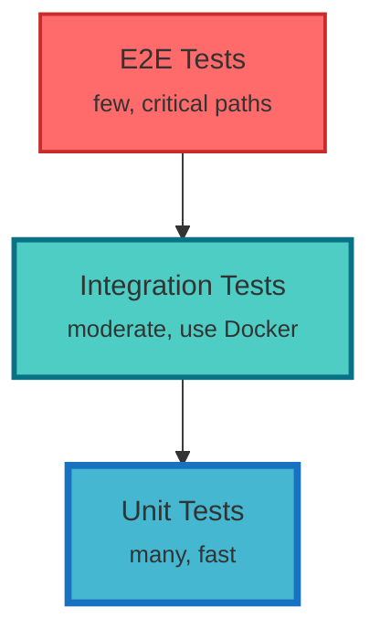

# Contributing to Universal Repository Cloner

Thank you for your interest in contributing! This project follows **Test-Driven Development (TDD)** methodology to ensure high code quality and maintainability.

## Table of Contents
- [Development Environment](#development-environment)
- [TDD Workflow](#tdd-workflow)
- [Testing Strategy](#testing-strategy)
- [Code Quality Standards](#code-quality-standards)
- [Pull Request Process](#pull-request-process)
- [Project Structure](#project-structure)

## Development Environment

### Prerequisites
- Python 3.10 or higher (3.10, 3.11, 3.12 supported)
- Docker and Docker Compose (for integration tests)
- Git 2.30+
- Git LFS (optional, for LFS tests)

### Setup

1. **Clone the repository**
```bash
git clone https://github.com/montge/repo-cloner.git
cd repo-cloner
```

2. **Create virtual environment**
```bash
python3 -m venv .venv
source .venv/bin/activate  # On Windows: .venv\Scripts\activate
```

3. **Install development dependencies**
```bash
make install-dev
# Or manually:
pip install -r requirements-dev.txt
```

4. **Install pre-commit hooks**
```bash
make pre-commit
# Or manually:
pre-commit install
```

5. **Verify setup**
```bash
# Run unit tests (fast, no Docker)
make test-unit

# Start Docker infrastructure
make docker-up

# Run integration tests
make test-integration

# Stop Docker
make docker-down
```

## TDD Workflow

We follow strict TDD: **Write tests FIRST, then implement features**.

### The Red-Green-Refactor Cycle

1. **🔴 Red**: Write a failing test
2. **🟢 Green**: Write minimum code to make test pass
3. **🔵 Refactor**: Improve code while keeping tests green

### Example TDD Workflow

**Feature**: Implement `clone_mirror()` function

#### Step 1: Write Failing Test (Red 🔴)

```python
# tests/unit/test_git_client.py
import pytest
from repo_cloner.git_client import GitClient

def test_clone_mirror_creates_local_repo():
    """Test that clone_mirror creates a local repository."""
    client = GitClient()

    result = client.clone_mirror(
        source_url="https://github.com/test/repo.git",
        local_path="/tmp/test-repo"
    )

    assert result.success is True
    assert result.local_path == "/tmp/test-repo"
    assert result.branches_count > 0
```

Run test: `pytest tests/unit/test_git_client.py::test_clone_mirror_creates_local_repo -v`

**Expected**: Test fails (🔴 Red) because `clone_mirror()` doesn't exist.

#### Step 2: Implement Minimum Code (Green 🟢)

```python
# src/repo_cloner/git_client.py
from dataclasses import dataclass

@dataclass
class CloneResult:
    success: bool
    local_path: str
    branches_count: int

class GitClient:
    def clone_mirror(self, source_url: str, local_path: str) -> CloneResult:
        # Minimum implementation to pass test
        import git
        repo = git.Repo.clone_from(source_url, local_path, mirror=True)
        branches = list(repo.branches)

        return CloneResult(
            success=True,
            local_path=local_path,
            branches_count=len(branches)
        )
```

Run test: `pytest tests/unit/test_git_client.py::test_clone_mirror_creates_local_repo -v`

**Expected**: Test passes (🟢 Green).

#### Step 3: Refactor (Blue 🔵)

```python
# src/repo_cloner/git_client.py
from dataclasses import dataclass
from pathlib import Path
import git

@dataclass
class CloneResult:
    success: bool
    local_path: str
    branches_count: int
    error_message: str = ""

class GitClient:
    def clone_mirror(self, source_url: str, local_path: str) -> CloneResult:
        """
        Clone a Git repository as a mirror.

        Args:
            source_url: URL of the source repository
            local_path: Local path for the cloned repository

        Returns:
            CloneResult with success status and metadata
        """
        try:
            Path(local_path).mkdir(parents=True, exist_ok=True)
            repo = git.Repo.clone_from(source_url, local_path, mirror=True)
            branches = list(repo.branches)

            return CloneResult(
                success=True,
                local_path=local_path,
                branches_count=len(branches)
            )
        except git.GitCommandError as e:
            return CloneResult(
                success=False,
                local_path=local_path,
                branches_count=0,
                error_message=str(e)
            )
```

Run tests again: All tests should still pass (🟢 Green).

## Testing Strategy

### Test Pyramid



### Test Types

#### Unit Tests (70% of tests)
- **Fast**: <1 second each
- **No external dependencies**: Mock all I/O
- **Located**: `tests/unit/`
- **Run with**: `make test-unit`

```python
# tests/unit/test_config.py
import pytest
from repo_cloner.config import ConfigManager

def test_config_loads_from_yaml(tmp_path):
    """Unit test - no external dependencies."""
    config_file = tmp_path / "config.yml"
    config_file.write_text("""
    gitlab:
      url: https://gitlab.com
      token: test-token
    """)

    config = ConfigManager.load(config_file)
    assert config.gitlab.url == "https://gitlab.com"
    assert config.gitlab.token == "test-token"
```

#### Integration Tests (25% of tests)
- **Medium speed**: Use real Docker services
- **External dependencies**: LocalStack, Azurite, MinIO
- **Located**: `tests/integration/`
- **Run with**: `make test-integration`

```python
# tests/integration/test_s3_storage.py
import pytest
from repo_cloner.storage import S3Storage

@pytest.mark.integration
@pytest.mark.s3
def test_s3_upload_and_download(localstack_s3):
    """Integration test - uses LocalStack Docker container."""
    storage = S3Storage(endpoint_url="http://localhost:4566")

    # Upload
    result = storage.upload("test-bucket", "test.txt", b"Hello World")
    assert result.success is True

    # Download
    data = storage.download("test-bucket", "test.txt")
    assert data == b"Hello World"
```

#### E2E Tests (5% of tests)
- **Slow**: Full workflows
- **Real APIs**: Use test accounts
- **Run**: Manually or in nightly CI

### Test Markers

Use pytest markers to categorize tests:

```python
@pytest.mark.unit          # Unit test
@pytest.mark.integration   # Integration test
@pytest.mark.slow          # Slow test (>5 seconds)
@pytest.mark.gitlab        # Requires GitLab API
@pytest.mark.github        # Requires GitHub API
@pytest.mark.s3            # Requires S3/LocalStack
```

Run specific tests:
```bash
pytest -m unit              # Only unit tests
pytest -m "integration and s3"  # Integration tests for S3
pytest -m "not slow"        # Skip slow tests
```

## Code Quality Standards

### Formatting
- **Black**: Line length 100
- **isort**: Black-compatible profile

```bash
make format  # Auto-format all code
```

### Linting
- **flake8**: Max line length 100
- **pylint**: Enforce best practices

```bash
make lint
```

### Type Checking
- **mypy**: Static type checking

```bash
make type-check
```

### Coverage
- **Minimum**: 80% coverage required
- **Target**: >85% coverage

```bash
make coverage  # Generate HTML coverage report
```

### Pre-commit Hooks

All commits must pass:
- ✅ Black formatting
- ✅ isort import sorting
- ✅ flake8 linting
- ✅ mypy type checking
- ✅ Trailing whitespace removal
- ✅ YAML/JSON validation

## Pull Request Process

### Before Creating PR

1. **Write tests first** (TDD)
2. **Implement features** to pass tests
3. **Ensure all tests pass**:
   ```bash
   make test
   ```
4. **Check code quality**:
   ```bash
   make format
   make lint
   make type-check
   ```
5. **Verify coverage** (>80%):
   ```bash
   make coverage
   ```

### PR Requirements

- ✅ All tests pass (unit + integration)
- ✅ Code coverage ≥80%
- ✅ All pre-commit hooks pass
- ✅ Clear description of changes
- ✅ Reference related issues
- ✅ Update documentation if needed

### PR Template

```markdown
## Description
Brief description of changes

## Type of Change
- [ ] Bug fix
- [ ] New feature
- [ ] Breaking change
- [ ] Documentation update

## Tests Added
- `test_feature_x()` - Tests X functionality
- `test_feature_y()` - Tests Y edge case

## Checklist
- [ ] Tests written first (TDD)
- [ ] All tests pass
- [ ] Code formatted (black, isort)
- [ ] Linting passes (flake8, pylint)
- [ ] Type checking passes (mypy)
- [ ] Coverage ≥80%
- [ ] Documentation updated
```

## Project Structure

```
repo-cloner/
├── src/
│   └── repo_cloner/
│       ├── __init__.py
│       ├── git_client.py      # Git operations
│       ├── github_client.py   # GitHub API
│       ├── gitlab_client.py   # GitLab API
│       ├── storage/           # Storage backends
│       ├── sync/              # Sync engine
│       └── cli/               # CLI interface
├── tests/
│   ├── unit/                  # Fast unit tests
│   ├── integration/           # Docker-based integration tests
│   └── fixtures/              # Test fixtures
├── docs/                      # Documentation
├── .github/
│   └── workflows/             # CI/CD workflows
├── REQUIREMENTS.md            # Functional requirements
├── ROADMAP.md                 # Sprint plan
└── README.md                  # User documentation
```

## Getting Help

- **Questions**: Open a [Discussion](https://github.com/montge/repo-cloner/discussions)
- **Bugs**: Open an [Issue](https://github.com/montge/repo-cloner/issues)
- **Features**: Discuss first, then create Issue

## Code of Conduct

- Be respectful and professional
- Follow TDD methodology
- Write clear, maintainable code
- Help others learn and grow

## License

By contributing to repo-cloner, you agree that your contributions will be licensed under the [Apache License 2.0](LICENSE).

### Contributor Agreement

When you submit a contribution (pull request, issue, comment, or other submission), you certify that:

1. **You have the right to submit the contribution** - The contribution is your original work, or you have permission to submit it
2. **You grant the project a license** - You grant repo-cloner and recipients of software distributed by repo-cloner a perpetual, worldwide, non-exclusive, no-charge, royalty-free license to use, reproduce, modify, display, perform, sublicense, and distribute your contribution as part of the project
3. **Your contribution doesn't violate any third-party rights** - Your contribution doesn't include proprietary or confidential information, and doesn't violate patents, copyrights, trademarks, or other rights
4. **You understand the license** - You have read and understand the Apache License 2.0

### Developer Certificate of Origin (DCO)

By making a contribution to this project, you certify that:

- The contribution was created in whole or in part by you and you have the right to submit it under the Apache 2.0 license
- The contribution is based upon previous work that, to the best of your knowledge, is covered under an appropriate open source license and you have the right under that license to submit that work with modifications
- The contribution was provided directly to you by some other person who certified as above, and you have not modified it

### AI-Assisted Contributions

If you use AI coding assistants (like GitHub Copilot, Claude Code, ChatGPT, etc.) for your contributions:

- You remain fully responsible for the contribution
- Ensure the AI-generated code doesn't violate any licenses or copyrights
- Review and test all AI-generated code thoroughly
- Optionally add co-authorship attribution in commit messages:
  ```
  Co-Authored-By: Claude <noreply@anthropic.com>
  ```

---

**Happy Coding! 🚀**
