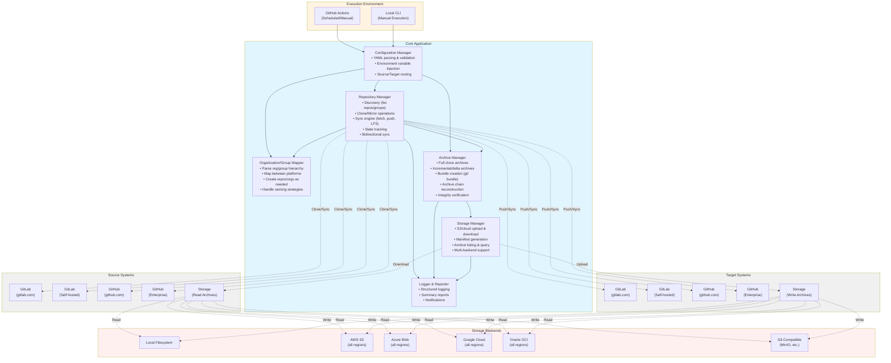
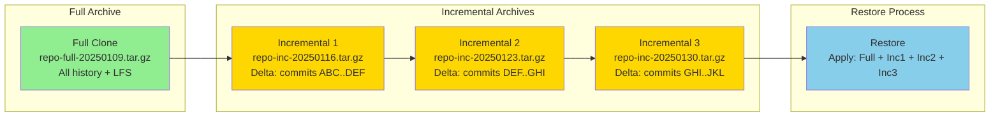

# Requirements Document: Universal Repository Cloner & Synchronization Tool

## Executive Summary

A flexible tool to clone and synchronize Git repositories between GitLab (self-hosted or gitlab.com), GitHub (Enterprise or github.com), and S3-compatible storage. Supports bidirectional synchronization, air-gap workflows with full and incremental archives, and both automated GitHub Actions workflows and manual local execution.

**Supported Source/Target Combinations:**
- **Git Platforms**: GitLab ↔ GitHub (bidirectional sync and migration)
- **Platform Migrations**: GitLab ↔ GitLab, GitHub ↔ GitHub (instance/org-to-instance/org)
- **Storage Backends**: Any Git platform ↔ Storage (archive/restore for air-gap)
  - Local Filesystem
  - AWS S3 (all regions)
  - Azure Blob Storage (all regions)
  - Google Cloud Storage (all regions)
  - Oracle Cloud Infrastructure Object Storage (all regions)
  - S3-compatible storage (MinIO, Ceph, etc.)

## Functional Requirements

### FR-1: Repository Cloning & Source/Target Support
- **FR-1.1**: Support full mirror clones from any Git hosting platform
- **FR-1.2**: Preserve all branches, tags, and commit history
- **FR-1.3**: Support Git LFS (Large File Storage) objects
- **FR-1.4**: Handle both public and private repositories
- **FR-1.5**: Support repository-level metadata (description, topics/tags where applicable)
- **FR-1.6**: Support all source/target combinations:
  - **GitLab ↔ GitHub**: Cross-platform migration and bidirectional sync
  - **GitLab ↔ GitLab**: Instance-to-instance migration (cloud to self-hosted, etc.)
  - **GitHub ↔ GitHub**: Organization-to-organization migration
  - **Any Git platform ↔ Storage**: Archive/restore for air-gap environments
- **FR-1.7**: Support multiple storage backend types:
  - **Local Filesystem**: Direct archive to local/network file system paths
  - **AWS S3**: S3 buckets with region selection (us-east-1, eu-west-1, ap-southeast-1, etc.)
  - **Azure Blob Storage**: Azure Storage Accounts with region selection
  - **Google Cloud Storage (GCS)**: GCS buckets with region/multi-region selection
  - **Oracle OCI Object Storage**: OCI buckets with region selection
  - **S3-Compatible**: MinIO, Ceph, DigitalOcean Spaces, etc.

### FR-2: Authentication & Authorization
- **FR-2.1**: Support GitLab authentication via:
  - Personal Access Token (PAT)
  - Username/Password (if required for legacy systems)
- **FR-2.2**: Support GitHub authentication via:
  - Personal Access Token
  - GitHub App credentials (for enterprise scenarios)
- **FR-2.3**: Support cloud storage authentication:
  - **AWS S3**: IAM credentials, IAM roles, access keys, session tokens
  - **Azure Blob**: Connection strings, SAS tokens, Azure AD authentication
  - **GCS**: Service account JSON keys, OAuth 2.0, ADC (Application Default Credentials)
  - **Oracle OCI**: API signing keys, instance principals, user credentials
  - **S3-Compatible**: Access key/secret key pairs
- **FR-2.4**: Secure credential management (environment variables, secrets, credential files)
- **FR-2.5**: Support for both cloud and on-premise instances:
  - GitLab: gitlab.com and self-hosted GitLab
  - GitHub: github.com and GitHub Enterprise Server

### FR-3: Synchronization
- **FR-3.1**: Keep cloned repositories in sync with source repositories (any platform)
- **FR-3.2**: Detect and sync new commits, branches, and tags
- **FR-3.3**: Handle force pushes and branch deletions
- **FR-3.4**: Configurable sync frequency (scheduled via cron/GitHub Actions)
- **FR-3.5**: Detect conflicts with local changes and provide resolution strategy
- **FR-3.6**: Support bidirectional synchronization with conflict detection
- **FR-3.7**: Allow sync direction configuration (source → target, target → source, bidirectional)

### FR-4: Organization & Group Structure Mapping
- **FR-4.1**: Map between different organizational structures (GitLab groups ↔ GitHub orgs)
- **FR-4.2**: Implement naming strategy for nested structures:
  - Option A: Flatten with naming convention (e.g., `group-subgroup-repo`)
  - Option B: Use Topics/Labels to represent hierarchy
  - Option C: Use separate organizations for top-level groups
  - Option D: Repository name prefixing (e.g., `backend-auth-service`)
- **FR-4.3**: Maintain mapping configuration file for org/group translation
- **FR-4.4**: Support selective filtering (clone only specific orgs/groups)
- **FR-4.5**: Handle GitHub org → GitHub org mapping (for org migrations)
- **FR-4.6**: Handle GitLab group → GitLab group mapping (for instance migrations)

### FR-5: Air-Gap Environment Support & Archive Management
- **FR-5.1**: Export repositories to archive format (tar.gz with git bundle)
- **FR-5.2**: Upload archives to multiple storage backends:
  - **Local Filesystem**: Absolute or relative paths, network mounts (NFS, SMB)
  - **AWS S3**: Bucket + key with region specification
  - **Azure Blob Storage**: Container + blob with storage account region
  - **GCS**: Bucket + object with location (region/multi-region/dual-region)
  - **Oracle OCI Object Storage**: Bucket + object with namespace and region
  - **S3-Compatible**: Custom endpoint URL with bucket/key
- **FR-5.3**: Support region selection for cloud storage:
  - **AWS**: us-east-1, us-west-2, eu-west-1, ap-southeast-1, etc. (all regions)
  - **Azure**: eastus, westeurope, southeastasia, etc. (all regions)
  - **GCS**: us-central1, europe-west1, asia-east1, multi-region (US, EU, ASIA)
  - **Oracle OCI**: us-ashburn-1, us-phoenix-1, eu-frankfurt-1, etc. (all regions)
- **FR-5.4**: Include LFS objects in exports
- **FR-5.5**: Support two archive modes:
  - **Full Clone**: Complete repository with all history and LFS objects
  - **Incremental/Delta**: Only new commits, branches, tags since last archive
- **FR-5.6**: Provide import/restore functionality from archives to any Git platform
- **FR-5.7**: Generate manifest file with repository metadata for each export:
  - Repository name, source URL, archive type (full/incremental)
  - Timestamp, size, branches, tags, commit range
  - Storage backend type and location (path/bucket/container)
  - LFS object count and size
  - Parent archive reference (for incremental archives)
- **FR-5.8**: Support archive chain reconstruction (base + incremental deltas)
- **FR-5.9**: Verify archive integrity with checksums (SHA256)
- **FR-5.10**: List and query available archives across all storage backends
- **FR-5.11**: Support archive retention policies (delete old archives after N days/versions)

### FR-6: Execution Modes
- **FR-6.1**: GitHub Actions workflow for automated nightly execution
- **FR-6.2**: CLI tool for manual local execution
- **FR-6.3**: Support dry-run mode for testing
- **FR-6.4**: Single repository mode (clone/sync one repo)
- **FR-6.5**: Batch mode (process multiple repos from configuration)

### FR-7: Configuration Management
- **FR-7.1**: YAML/JSON configuration file format
- **FR-7.2**: Configure per-repository or per-group settings:
  - Source GitLab URL and project/group paths
  - Target GitHub organization and repository names
  - Sync strategy (mirror, selective branches, etc.)
  - LFS enabled/disabled
  - Archive/export settings
- **FR-7.3**: Support configuration inheritance (global defaults, per-group overrides)
- **FR-7.4**: Environment-specific configurations (dev, staging, prod)

### FR-8: Logging & Monitoring
- **FR-8.1**: Detailed logging with configurable levels (DEBUG, INFO, WARN, ERROR)
- **FR-8.2**: Log sync operations: success/failure, files changed, conflicts
- **FR-8.3**: Generate summary reports after each sync
- **FR-8.4**: Support JSON-structured logging for parsing
- **FR-8.5**: Integration with monitoring systems (optional: Prometheus metrics, webhooks)

### FR-9: Error Handling & Recovery
- **FR-9.1**: Graceful handling of network failures with retry logic
- **FR-9.2**: Continue processing remaining repositories if one fails
- **FR-9.3**: Provide clear error messages and troubleshooting guidance
- **FR-9.4**: State management to resume interrupted operations
- **FR-9.5**: Notification mechanism for failures (email, Slack, etc.)

### FR-10: Local Fork Support
- **FR-10.1**: Cloned repositories should allow local forking in GitHub
- **FR-10.2**: Support branch protection rules to prevent accidental overwrites
- **FR-10.3**: Document workflow for adding local features while maintaining upstream sync
- **FR-10.4**: Optional: Track local-only branches (exclude from sync)

## Non-Functional Requirements

### NFR-1: Performance
- **NFR-1.1**: Efficiently handle large repositories (multi-GB)
- **NFR-1.2**: Support concurrent cloning/syncing (configurable parallelism)
- **NFR-1.3**: Incremental syncs should be faster than full clones
- **NFR-1.4**: LFS object deduplication where possible

### NFR-2: Reliability
- **NFR-2.1**: 99%+ success rate for sync operations under normal conditions
- **NFR-2.2**: Data integrity verification (checksum validation)
- **NFR-2.3**: Atomic operations where possible (all-or-nothing commits)

### NFR-3: Security
- **NFR-3.1**: Never log sensitive credentials
- **NFR-3.2**: Use secure credential storage mechanisms
- **NFR-3.3**: Support for credential rotation without code changes
- **NFR-3.4**: Audit trail of sync operations
- **NFR-3.5**: Comply with enterprise security policies

### NFR-4: Maintainability
- **NFR-4.1**: Well-documented codebase with inline comments
- **NFR-4.2**: Modular architecture for easy extension
- **NFR-4.3**: Comprehensive test coverage (>80%)
- **NFR-4.4**: Clear contribution guidelines

### NFR-5: Portability
- **NFR-5.1**: Run on Linux, macOS, and Windows
- **NFR-5.2**: Minimal external dependencies
- **NFR-5.3**: Docker container support for consistent execution

### NFR-6: Usability
- **NFR-6.1**: Intuitive CLI interface with helpful documentation
- **NFR-6.2**: Clear configuration examples
- **NFR-6.3**: Verbose mode for troubleshooting
- **NFR-6.4**: Setup wizard for initial configuration (optional)

## Technology Stack Considerations

### Python vs Node.js Analysis

#### Python Pros:
- **GitPython library**: Mature, well-documented Git operations
- **PyGithub & python-gitlab**: Excellent API client libraries
- **Rich cloud storage ecosystem**:
  - boto3 (AWS S3) - industry standard
  - azure-storage-blob (Azure Blob Storage)
  - google-cloud-storage (GCS)
  - oci (Oracle Cloud Infrastructure)
- **CLI & config libraries**: click/argparse (CLI), PyYAML (config)
- **Enterprise adoption**: Common in DevOps/automation
- **Better subprocess handling**: Easier to shell out to git CLI when needed
- **Data processing**: Superior for parsing/transforming data structures

#### Python Cons:
- Dependency management can be complex (virtualenv, poetry, pipenv)
- Slightly slower startup time for CLI tools

#### Node.js Pros:
- **Native GitHub Actions integration**: JavaScript/TypeScript is first-class
- **async/await**: Natural for concurrent operations
- **Simple-git, Octokit, GitLab SDK**: Good libraries available
- **Fast startup**: Better for CLI tools
- **Package management**: npm/yarn well-established

#### Node.js Cons:
- Git operations often require shelling out to CLI
- LFS support may be less mature
- Less common for this type of DevOps tooling

### Recommendation: **Python**

**Rationale:**
1. **Git operations maturity**: GitPython + git CLI integration is more robust
2. **API client libraries**: PyGithub and python-gitlab are feature-complete and well-maintained
3. **Multi-cloud storage support**: Native Python SDKs for all major cloud providers:
   - boto3 (AWS) - most mature cloud SDK
   - azure-storage-blob (Azure) - official Microsoft SDK
   - google-cloud-storage (GCS) - official Google SDK
   - oci (Oracle) - official Oracle SDK
4. **DevOps ecosystem fit**: Python is the standard for infrastructure automation
5. **Better error handling**: For complex git operations and file system work
6. **LFS support**: Easier integration with git-lfs CLI tools

## Technical Architecture (High-Level)



### Supported Data Flow Paths

The architecture supports all the following synchronization paths:

**Platform-to-Platform Sync:**
1. **GitLab → GitHub**: `GL1/GL2 → RepoMgr → OrgMapper → GHT1/GHT2`
2. **GitHub → GitLab**: `GH1/GH2 → RepoMgr → OrgMapper → GLT1/GLT2`
3. **GitLab → GitLab**: `GL1/GL2 → RepoMgr → OrgMapper → GLT1/GLT2`
4. **GitHub → GitHub**: `GH1/GH2 → RepoMgr → OrgMapper → GHT1/GHT2`

**Platform-to-Storage Archive:**
5. **GitLab → Storage**: `GL1/GL2 → RepoMgr → ArchiveMgr → StorageMgr → Storage (FS/S3/Azure/GCS/OCI)`
6. **GitHub → Storage**: `GH1/GH2 → RepoMgr → ArchiveMgr → StorageMgr → Storage (FS/S3/Azure/GCS/OCI)`

**Storage-to-Platform Restore:**
7. **Storage → GitLab**: `Storage → StorageMgr → ArchiveMgr → RepoMgr → GLT1/GLT2`
8. **Storage → GitHub**: `Storage → StorageMgr → ArchiveMgr → RepoMgr → GHT1/GHT2`

**Storage Backends (pluggable):**
- Local Filesystem (NFS, SMB mounts)
- AWS S3 (all regions: us-east-1, eu-west-1, ap-southeast-1, etc.)
- Azure Blob Storage (all regions: eastus, westeurope, southeastasia, etc.)
- Google Cloud Storage (all regions/multi-regions: us-central1, EU, ASIA, etc.)
- Oracle OCI Object Storage (all regions: us-ashburn-1, eu-frankfurt-1, etc.)
- S3-Compatible (MinIO, Ceph, DigitalOcean Spaces, Wasabi, etc.)

### Archive Strategy



**Archive Types:**
- **Full Archive**: Complete git bundle with all refs, commits, and LFS objects
- **Incremental Archive**: Delta bundle containing only new commits/refs since last archive
- **Manifest**: JSON file describing archive contents, parent references, and metadata

## Out of Scope (For Initial Release)

- Wiki/documentation page cloning
- Issue/PR migration
- CI/CD pipeline migration
- Container registry mirroring
- Package registry syncing
- Merge request/Pull request state preservation
- User/permission synchronization
- Advanced conflict resolution UI (manual resolution only)
- Real-time synchronization (scheduled only)

## Success Criteria

1. Successfully clone and sync at least 100 repositories in a single run
2. Handle repositories up to 10GB with LFS objects
3. Complete nightly sync in under 2 hours for typical workload
4. Zero data loss or corruption incidents
5. Clear documentation enabling new users to set up in under 30 minutes
6. 90%+ test coverage with integration tests against real Git operations

## Testing Infrastructure & Mocking Strategy

To enable comprehensive TDD without requiring accounts on all cloud providers and Git platforms, the following local emulators and mocking tools will be used:

### Cloud Storage Emulators

| Provider | Emulator/Mock Tool | Implementation |
|----------|-------------------|----------------|
| **AWS S3** | **LocalStack** (free tier) or **moto** | LocalStack provides full S3 API emulation; moto is Python library for mocking boto3 calls |
| **Azure Blob** | **Azurite** (official Microsoft emulator) | Full Azure Storage emulation including Blob, Queue, and Table |
| **Google Cloud Storage** | **fake-gcs-server** or **gcs-emulator** | Standalone GCS emulator with full API compatibility |
| **Oracle OCI** | **Mock testing with responses/unittest.mock** | No official emulator; use Python mocking libraries to simulate OCI SDK calls |
| **S3-Compatible** | **MinIO** (actual S3-compatible server) | Run MinIO locally as real S3-compatible storage for testing |
| **Local Filesystem** | **pytest tmpdir/tmp_path fixtures** | Native Python testing with temporary directories |

### Git Platform Emulators

| Platform | Emulator/Mock Tool | Implementation |
|----------|-------------------|----------------|
| **GitLab** | **GitLab Docker Container** (gitlab/gitlab-ce) | Run actual GitLab CE locally via Docker for integration tests |
| **GitLab API** | **responses** or **requests-mock** libraries | Mock python-gitlab HTTP calls for unit tests |
| **GitHub** | **GitHub API mocking with responses** | Mock PyGithub HTTP calls; no local GitHub available |
| **GitHub (advanced)** | **Gitea** or **Gogs** (Git hosting alternatives) | Lightweight Git servers with GitHub-like APIs for integration tests |
| **Git operations** | **Local Git repositories** | Create test repos with git CLI in temporary directories |

### Testing Strategy by Layer

**Unit Tests (Fast, No External Dependencies):**
- Use **moto** for S3 operations (in-memory mocking)
- Use **responses** or **requests-mock** for GitLab/GitHub API calls
- Use **unittest.mock** for OCI SDK calls
- Use **pytest tmp_path** for filesystem operations
- Mock all external HTTP/API calls

**Integration Tests (Medium Speed, Local Services):**
- Use **LocalStack** for AWS S3 (Docker container)
- Use **Azurite** for Azure Blob (Docker container or NPM package)
- Use **fake-gcs-server** for GCS (Docker container)
- Use **MinIO** for S3-compatible testing (Docker container)
- Use **GitLab CE Docker** for GitLab integration tests
- Use **Gitea/Gogs Docker** for lightweight Git server tests
- Real git operations with local repositories

**E2E Tests (Slow, Optional Real Services):**
- Use actual cloud services if credentials available (CI/CD only)
- Use test accounts on GitLab.com and GitHub.com
- Full workflow testing with real APIs

### Recommended Testing Tools (Python Libraries)

```python
# requirements-dev.txt
pytest>=7.0.0
pytest-cov>=4.0.0
pytest-mock>=3.10.0
moto[s3]>=4.0.0           # AWS S3 mocking
responses>=0.20.0          # HTTP response mocking
requests-mock>=1.9.0       # Alternative HTTP mocking
faker>=18.0.0              # Generate test data
freezegun>=1.2.0           # Mock datetime for testing
docker>=6.0.0              # Control Docker containers from tests
testcontainers>=3.7.0      # Manage test Docker containers
```

### Docker Compose for Local Testing

A `docker-compose.test.yml` will provide all local emulators:

```yaml
version: '3.8'
services:
  # AWS S3 emulator
  localstack:
    image: localstack/localstack:latest
    ports:
      - "4566:4566"  # LocalStack edge port
    environment:
      - SERVICES=s3
      - DEFAULT_REGION=us-east-1

  # Azure Blob emulator
  azurite:
    image: mcr.microsoft.com/azure-storage/azurite:latest
    ports:
      - "10000:10000"  # Blob service

  # GCS emulator
  fake-gcs-server:
    image: fsouza/fake-gcs-server:latest
    ports:
      - "4443:4443"
    command: ["-scheme", "http"]

  # MinIO (S3-compatible)
  minio:
    image: minio/minio:latest
    ports:
      - "9000:9000"
      - "9001:9001"  # Console
    environment:
      - MINIO_ROOT_USER=minioadmin
      - MINIO_ROOT_PASSWORD=minioadmin
    command: server /data --console-address ":9001"

  # GitLab CE (for integration tests)
  gitlab:
    image: gitlab/gitlab-ce:latest
    ports:
      - "8080:80"
      - "8443:443"
      - "8022:22"
    environment:
      GITLAB_OMNIBUS_CONFIG: |
        external_url 'http://localhost:8080'

  # Gitea (lightweight Git server)
  gitea:
    image: gitea/gitea:latest
    ports:
      - "3000:3000"
      - "3022:22"
    environment:
      - USER_UID=1000
      - USER_GID=1000
```

### Test Execution Strategy

1. **Local Development**: Use mocked services (moto, responses) - instant feedback
2. **Pre-Commit**: Unit tests + filesystem integration tests
3. **CI/CD Pipeline**:
   - Run all unit tests with mocks
   - Spin up Docker Compose with emulators for integration tests
   - Optionally run E2E tests against real services (using secrets)

### Benefits of This Approach

✅ **No cloud accounts needed** for development and most testing
✅ **Fast test execution** with in-memory mocks
✅ **Consistent test environment** across all developers
✅ **Offline development** possible with local emulators
✅ **Cost-effective** - no cloud API charges for testing
✅ **True TDD** - write tests first without external dependencies

## Assumptions & Dependencies

- Git CLI installed on execution environment (v2.30+)
- Git LFS CLI installed if LFS support needed
- Network connectivity between GitLab and GitHub (for non-air-gap in production)
- Sufficient disk space for temporary clone storage
- API rate limits are sufficient for planned operations (production only)
- Users have necessary permissions on both GitLab and GitHub (production only)
- **Development/Testing**: Docker installed for running emulators (optional but recommended)
- **CI/CD**: Docker Compose for integration test environment
