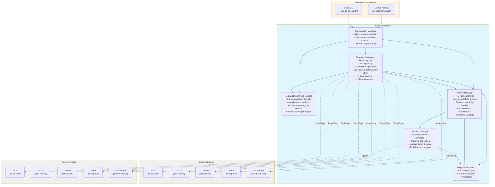
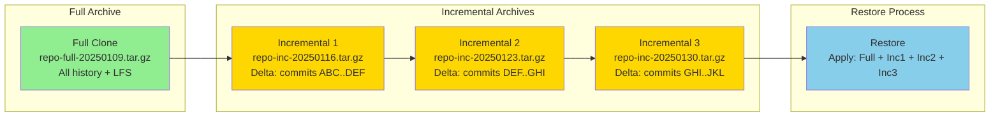

# Requirements Document: Universal Repository Cloner & Synchronization Tool

## Executive Summary

A flexible tool to clone and synchronize Git repositories between GitLab (self-hosted or gitlab.com), GitHub (Enterprise or github.com), and S3-compatible storage. Supports bidirectional synchronization, air-gap workflows with full and incremental archives, and both automated GitHub Actions workflows and manual local execution.

**Supported Source/Target Combinations:**
- GitLab ↔ GitHub (bidirectional)
- GitLab ↔ GitLab (instance-to-instance migration)
- GitHub ↔ GitHub (org-to-org migration)
- GitLab → S3 (archive for air-gap)
- GitHub → S3 (archive for air-gap)
- S3 → GitLab (restore from air-gap)
- S3 → GitHub (restore from air-gap)

## Functional Requirements

### FR-1: Repository Cloning & Source/Target Support
- **FR-1.1**: Support full mirror clones from any Git hosting platform
- **FR-1.2**: Preserve all branches, tags, and commit history
- **FR-1.3**: Support Git LFS (Large File Storage) objects
- **FR-1.4**: Handle both public and private repositories
- **FR-1.5**: Support repository-level metadata (description, topics/tags where applicable)
- **FR-1.6**: Support all source/target combinations:
  - **GitLab → GitHub**: Primary use case for cross-platform migration
  - **GitHub → GitLab**: Reverse migration or backup
  - **GitLab → GitLab**: Instance-to-instance migration (cloud to self-hosted, etc.)
  - **GitHub → GitHub**: Organization-to-organization migration
  - **GitLab ↔ S3**: Archive/restore for air-gap environments
  - **GitHub ↔ S3**: Archive/restore for air-gap environments

### FR-2: Authentication & Authorization
- **FR-2.1**: Support GitLab authentication via:
  - Personal Access Token (PAT)
  - Username/Password (if required for legacy systems)
- **FR-2.2**: Support GitHub authentication via:
  - Personal Access Token
  - GitHub App credentials (for enterprise scenarios)
- **FR-2.3**: Secure credential management (environment variables, secrets)
- **FR-2.4**: Support for both cloud and on-premise instances:
  - GitLab: gitlab.com and self-hosted GitLab
  - GitHub: github.com and GitHub Enterprise Server

### FR-3: Synchronization
- **FR-3.1**: Keep cloned repositories in sync with source repositories (any platform)
- **FR-3.2**: Detect and sync new commits, branches, and tags
- **FR-3.3**: Handle force pushes and branch deletions
- **FR-3.4**: Configurable sync frequency (scheduled via cron/GitHub Actions)
- **FR-3.5**: Detect conflicts with local changes and provide resolution strategy
- **FR-3.6**: Support bidirectional synchronization with conflict detection
- **FR-3.7**: Allow sync direction configuration (source → target, target → source, bidirectional)

### FR-4: Organization & Group Structure Mapping
- **FR-4.1**: Map between different organizational structures (GitLab groups ↔ GitHub orgs)
- **FR-4.2**: Implement naming strategy for nested structures:
  - Option A: Flatten with naming convention (e.g., `group-subgroup-repo`)
  - Option B: Use Topics/Labels to represent hierarchy
  - Option C: Use separate organizations for top-level groups
  - Option D: Repository name prefixing (e.g., `backend-auth-service`)
- **FR-4.3**: Maintain mapping configuration file for org/group translation
- **FR-4.4**: Support selective filtering (clone only specific orgs/groups)
- **FR-4.5**: Handle GitHub org → GitHub org mapping (for org migrations)
- **FR-4.6**: Handle GitLab group → GitLab group mapping (for instance migrations)

### FR-5: Air-Gap Environment Support & Archive Management
- **FR-5.1**: Export repositories to archive format (tar.gz with git bundle)
- **FR-5.2**: Upload archives to S3-compatible storage (AWS S3, MinIO, etc.)
- **FR-5.3**: Support other storage backends (Azure Blob, GCS)
- **FR-5.4**: Include LFS objects in exports
- **FR-5.5**: Support two archive modes:
  - **Full Clone**: Complete repository with all history and LFS objects
  - **Incremental/Delta**: Only new commits, branches, tags since last archive
- **FR-5.6**: Provide import/restore functionality from archives to GitLab or GitHub
- **FR-5.7**: Generate manifest file with repository metadata for each export:
  - Repository name, source URL, archive type (full/incremental)
  - Timestamp, size, branches, tags, commit range
  - LFS object count and size
  - Parent archive reference (for incremental archives)
- **FR-5.8**: Support archive chain reconstruction (base + incremental deltas)
- **FR-5.9**: Verify archive integrity with checksums
- **FR-5.10**: List and query available archives in S3 storage

### FR-6: Execution Modes
- **FR-6.1**: GitHub Actions workflow for automated nightly execution
- **FR-6.2**: CLI tool for manual local execution
- **FR-6.3**: Support dry-run mode for testing
- **FR-6.4**: Single repository mode (clone/sync one repo)
- **FR-6.5**: Batch mode (process multiple repos from configuration)

### FR-7: Configuration Management
- **FR-7.1**: YAML/JSON configuration file format
- **FR-7.2**: Configure per-repository or per-group settings:
  - Source GitLab URL and project/group paths
  - Target GitHub organization and repository names
  - Sync strategy (mirror, selective branches, etc.)
  - LFS enabled/disabled
  - Archive/export settings
- **FR-7.3**: Support configuration inheritance (global defaults, per-group overrides)
- **FR-7.4**: Environment-specific configurations (dev, staging, prod)

### FR-8: Logging & Monitoring
- **FR-8.1**: Detailed logging with configurable levels (DEBUG, INFO, WARN, ERROR)
- **FR-8.2**: Log sync operations: success/failure, files changed, conflicts
- **FR-8.3**: Generate summary reports after each sync
- **FR-8.4**: Support JSON-structured logging for parsing
- **FR-8.5**: Integration with monitoring systems (optional: Prometheus metrics, webhooks)

### FR-9: Error Handling & Recovery
- **FR-9.1**: Graceful handling of network failures with retry logic
- **FR-9.2**: Continue processing remaining repositories if one fails
- **FR-9.3**: Provide clear error messages and troubleshooting guidance
- **FR-9.4**: State management to resume interrupted operations
- **FR-9.5**: Notification mechanism for failures (email, Slack, etc.)

### FR-10: Local Fork Support
- **FR-10.1**: Cloned repositories should allow local forking in GitHub
- **FR-10.2**: Support branch protection rules to prevent accidental overwrites
- **FR-10.3**: Document workflow for adding local features while maintaining upstream sync
- **FR-10.4**: Optional: Track local-only branches (exclude from sync)

## Non-Functional Requirements

### NFR-1: Performance
- **NFR-1.1**: Efficiently handle large repositories (multi-GB)
- **NFR-1.2**: Support concurrent cloning/syncing (configurable parallelism)
- **NFR-1.3**: Incremental syncs should be faster than full clones
- **NFR-1.4**: LFS object deduplication where possible

### NFR-2: Reliability
- **NFR-2.1**: 99%+ success rate for sync operations under normal conditions
- **NFR-2.2**: Data integrity verification (checksum validation)
- **NFR-2.3**: Atomic operations where possible (all-or-nothing commits)

### NFR-3: Security
- **NFR-3.1**: Never log sensitive credentials
- **NFR-3.2**: Use secure credential storage mechanisms
- **NFR-3.3**: Support for credential rotation without code changes
- **NFR-3.4**: Audit trail of sync operations
- **NFR-3.5**: Comply with enterprise security policies

### NFR-4: Maintainability
- **NFR-4.1**: Well-documented codebase with inline comments
- **NFR-4.2**: Modular architecture for easy extension
- **NFR-4.3**: Comprehensive test coverage (>80%)
- **NFR-4.4**: Clear contribution guidelines

### NFR-5: Portability
- **NFR-5.1**: Run on Linux, macOS, and Windows
- **NFR-5.2**: Minimal external dependencies
- **NFR-5.3**: Docker container support for consistent execution

### NFR-6: Usability
- **NFR-6.1**: Intuitive CLI interface with helpful documentation
- **NFR-6.2**: Clear configuration examples
- **NFR-6.3**: Verbose mode for troubleshooting
- **NFR-6.4**: Setup wizard for initial configuration (optional)

## Technology Stack Considerations

### Python vs Node.js Analysis

#### Python Pros:
- **GitPython library**: Mature, well-documented Git operations
- **PyGithub & python-gitlab**: Excellent API client libraries
- **Rich ecosystem**: boto3 (AWS), click/argparse (CLI), PyYAML (config)
- **Enterprise adoption**: Common in DevOps/automation
- **Better subprocess handling**: Easier to shell out to git CLI when needed
- **Data processing**: Superior for parsing/transforming data structures

#### Python Cons:
- Dependency management can be complex (virtualenv, poetry, pipenv)
- Slightly slower startup time for CLI tools

#### Node.js Pros:
- **Native GitHub Actions integration**: JavaScript/TypeScript is first-class
- **async/await**: Natural for concurrent operations
- **Simple-git, Octokit, GitLab SDK**: Good libraries available
- **Fast startup**: Better for CLI tools
- **Package management**: npm/yarn well-established

#### Node.js Cons:
- Git operations often require shelling out to CLI
- LFS support may be less mature
- Less common for this type of DevOps tooling

### Recommendation: **Python**

**Rationale:**
1. **Git operations maturity**: GitPython + git CLI integration is more robust
2. **API client libraries**: PyGithub and python-gitlab are feature-complete and well-maintained
3. **DevOps ecosystem fit**: Python is the standard for infrastructure automation
4. **Better error handling**: For complex git operations and file system work
5. **LFS support**: Easier integration with git-lfs CLI tools
6. **AWS/S3 integration**: boto3 is industry standard

## Technical Architecture (High-Level)

### Supported Data Flow Paths

The architecture supports all the following synchronization paths:

1. **GitLab → GitHub**: `GL1/GL2 → RepoMgr → OrgMapper → GHT1/GHT2`
2. **GitHub → GitLab**: `GH1/GH2 → RepoMgr → OrgMapper → GLT1/GLT2`
3. **GitLab → GitLab**: `GL1/GL2 → RepoMgr → OrgMapper → GLT1/GLT2`
4. **GitHub → GitHub**: `GH1/GH2 → RepoMgr → OrgMapper → GHT1/GHT2`
5. **GitLab → S3**: `GL1/GL2 → RepoMgr → ArchiveMgr → StorageMgr → S3Write`
6. **GitHub → S3**: `GH1/GH2 → RepoMgr → ArchiveMgr → StorageMgr → S3Write`
7. **S3 → GitLab**: `S3Read → StorageMgr → ArchiveMgr → RepoMgr → GLT1/GLT2`
8. **S3 → GitHub**: `S3Read → StorageMgr → ArchiveMgr → RepoMgr → GHT1/GHT2`

### Archive Strategy

**Archive Types:**
- **Full Archive**: Complete git bundle with all refs, commits, and LFS objects
- **Incremental Archive**: Delta bundle containing only new commits/refs since last archive
- **Manifest**: JSON file describing archive contents, parent references, and metadata

## Out of Scope (For Initial Release)

- Wiki/documentation page cloning
- Issue/PR migration
- CI/CD pipeline migration
- Container registry mirroring
- Package registry syncing
- Merge request/Pull request state preservation
- User/permission synchronization
- Advanced conflict resolution UI (manual resolution only)
- Real-time synchronization (scheduled only)

## Success Criteria

1. Successfully clone and sync at least 100 repositories in a single run
2. Handle repositories up to 10GB with LFS objects
3. Complete nightly sync in under 2 hours for typical workload
4. Zero data loss or corruption incidents
5. Clear documentation enabling new users to set up in under 30 minutes
6. 90%+ test coverage with integration tests against real Git operations

## Assumptions & Dependencies

- Git CLI installed on execution environment (v2.30+)
- Git LFS CLI installed if LFS support needed
- Network connectivity between GitLab and GitHub (for non-air-gap)
- Sufficient disk space for temporary clone storage
- API rate limits are sufficient for planned operations
- Users have necessary permissions on both GitLab and GitHub
