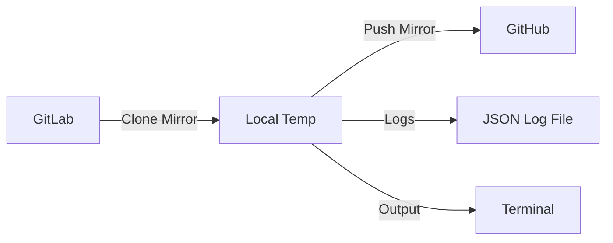
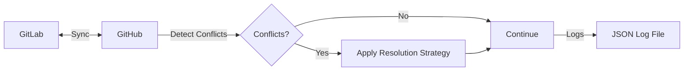
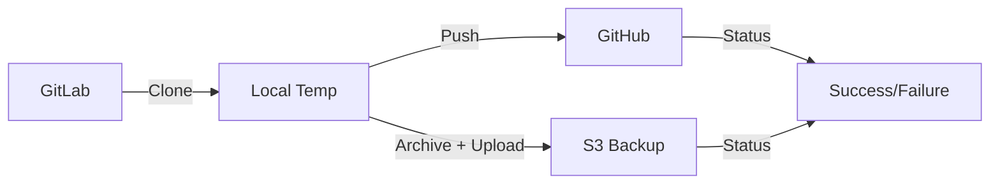
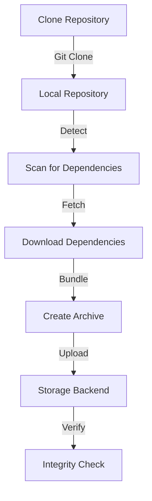
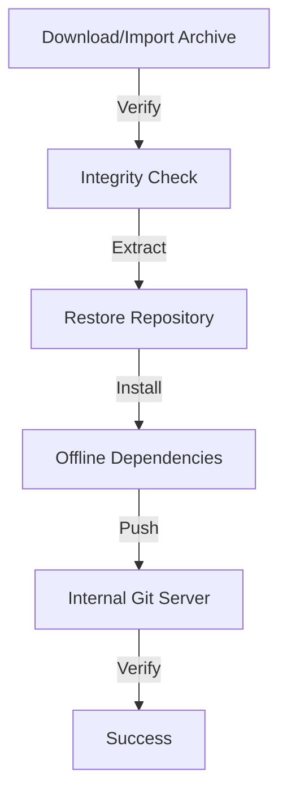

# Repository Synchronization Workflows

This guide provides end-to-end workflows for common repository synchronization scenarios with comprehensive logging, monitoring, and error handling.

## Table of Contents

- [Overview](#overview)
- [Direct Connection Workflows](#direct-connection-workflows)
  - [GitLab → GitHub Sync](#gitlab--github-sync)
  - [Bidirectional Sync](#bidirectional-sync)
  - [Multi-Target Sync](#multi-target-sync)
- [Air-Gap Workflows](#air-gap-workflows)
  - [Archive Creation](#archive-creation)
  - [Archive Transfer](#archive-transfer)
  - [Archive Restoration](#archive-restoration)
- [Monitoring & Operations](#monitoring--operations)
  - [Log Aggregation](#log-aggregation)
  - [Setting Up Alerts](#setting-up-alerts)
  - [Performance Monitoring](#performance-monitoring)
- [Troubleshooting](#troubleshooting)

---

## Overview

Repo-cloner supports two primary deployment models:

1. **Direct Connection**: Live synchronization between Git platforms with internet connectivity
2. **Air-Gap**: Archive-based workflow for environments without internet access

Both models include:
- ✅ Structured JSON logging for machine parsing
- ✅ User-friendly terminal output for operators
- ✅ Error handling with automatic retry
- ✅ Session tracking for correlation
- ✅ Progress indicators and timing

---

## Direct Connection Workflows

### GitLab → GitHub Sync

Synchronize repositories from GitLab to GitHub in real-time.

#### Workflow Diagram



#### Prerequisites

- GitLab Personal Access Token with `read_repository` scope
- GitHub Personal Access Token with `repo` scope
- Network connectivity to both platforms

#### Setup

```bash
# Set environment variables
export GITLAB_URL=https://gitlab.com
export GITLAB_TOKEN=glpat_xxxxxxxxxxxxx
export GITLAB_GROUP=backend

export GITHUB_ORG=myorg
export GITHUB_TOKEN=ghp_xxxxxxxxxxxxx
```

#### Execution

```bash
# Run the workflow
python examples/workflows/gitlab-to-github-sync.py
```

#### Expected Output

<details>
<summary>Click to expand terminal output</summary>

```
🚀 Starting GitLab → GitHub Synchronization
   Session ID: sync-20251013-153000
   Source: gitlab.com/backend
   Target: github.com/myorg

📁 Discovering repositories...
   ✓ Found 15 repositories in backend

📥 Syncing repositories:
   [1/15] backend-auth-service... ✓ (42 commits, 3 branches, 2.3s)
   [2/15] backend-api-gateway... ✓ (128 commits, 5 branches, 4.1s)
   [3/15] backend-user-service... ⚠ Network timeout (retrying...)
   [3/15] backend-user-service... ✓ (67 commits, 4 branches, 3.8s) [retry 1/3]
   [4/15] backend-notification... ✓ (91 commits, 3 branches, 3.2s)
   ...
   [15/15] backend-monitoring... ✓ (54 commits, 2 branches, 2.7s)

✅ Synchronization complete!

Summary:
  Total repositories: 15
  Successful: 15
  Failed: 0
  Total commits synced: 1,847
  Total time: 1m 42s

Logs saved to: /tmp/repo-cloner-sync-20251013-153000.log
```

</details>

#### Log Output

<details>
<summary>Click to expand JSON logs</summary>

```json
{
  "timestamp": "2025-10-13T15:30:00.123",
  "level": "INFO",
  "logger": "repo_cloner.workflows.gitlab_to_github",
  "message": "Synchronization session started",
  "session_id": "sync-20251013-153000",
  "source": "gitlab.com/backend",
  "target": "github.com/myorg"
}
{
  "timestamp": "2025-10-13T15:30:01.456",
  "level": "INFO",
  "logger": "repo_cloner.sync_engine",
  "message": "Repository sync completed",
  "session_id": "sync-20251013-153000",
  "repository": "backend-auth-service",
  "source_url": "https://gitlab.com/backend/backend-auth-service.git",
  "target_url": "https://github.com/myorg/backend-auth-service.git",
  "commits_synced": 42,
  "branches_synced": 3,
  "duration_seconds": 2.3,
  "status": "success"
}
{
  "timestamp": "2025-10-13T15:30:03.789",
  "level": "WARNING",
  "logger": "repo_cloner.git_client",
  "message": "Transient network error (will retry): Connection timeout",
  "session_id": "sync-20251013-153000",
  "repository": "backend-user-service",
  "retry_attempt": 1,
  "max_retries": 3
}
```

</details>

#### Configuration

Use `examples/configs/production-sync-with-logging.yml` for advanced configuration:

```yaml
logging:
  level: INFO
  format: json
  output:
    console: true
    file: /var/log/repo-cloner/sync.log

sources:
  - type: gitlab
    url: https://gitlab.com
    token: ${GITLAB_TOKEN}
    groups:
      - backend

targets:
  - type: github
    url: https://github.com
    organization: myorg
    token: ${GITHUB_TOKEN}
```

---

### Bidirectional Sync

Synchronize changes in both directions between two Git platforms.

#### Workflow Diagram



#### Features

- Detects divergent commits on same branch
- Conflict resolution strategies: `fail_fast`, `source_wins`, `target_wins`
- Logs conflicts for manual review
- State tracking for incremental sync

#### Configuration

```yaml
sync:
  mode: bidirectional
  conflict_resolution: fail  # fail, source_wins, target_wins
```

#### Expected Behavior

**No Conflicts:**
```
✓ backend-auth-service: No conflicts detected
✓ backend-api-gateway: No conflicts detected
```

**With Conflicts:**
```
⚠ backend-user-service: Conflict detected on branch 'main'
  GitLab HEAD: a1b2c3d
  GitHub HEAD: x9y8z7w
  Resolution: fail_fast (manual intervention required)
```

---

### Multi-Target Sync

Synchronize to multiple targets simultaneously (e.g., GitHub + S3 backup).

#### Workflow Diagram



#### Configuration

```yaml
targets:
  - type: github
    organization: myorg
    token: ${GITHUB_TOKEN}

  - type: s3
    bucket: myorg-repo-backups
    region: us-east-1
    prefix: production/
```

---

## Air-Gap Workflows

### Archive Creation

Create archives with dependencies for offline deployment.

#### Workflow Diagram



#### Phase 1: Setup

```bash
# Set environment variables
export SOURCE_REPO_URL=https://gitlab.com/myorg/backend-api
export ARCHIVE_OUTPUT_PATH=./archives
export ARCHIVE_TYPE=full  # or incremental
export INCLUDE_DEPENDENCIES=true
export STORAGE_TYPE=local
export STORAGE_PATH=/mnt/usb/repo-archives
```

#### Phase 2: Execute

```bash
# Create archive with dependencies
python examples/workflows/air-gap-archive-create.py
```

#### Expected Output

<details>
<summary>Click to expand terminal output</summary>

```
📦 Starting Air-Gap Archive Creation
   Session ID: archive-20251013-140000
   Source: https://gitlab.com/myorg/backend-api
   Archive type: full
   Output: ./archives

📥 Step 1/5: Cloning repository...
   ✓ Cloned successfully (5 branches, 3.2s)

🔍 Step 2/5: Detecting and fetching dependencies...
   Found 2 language(s): Python, Node.js
      Python: Fetching from PyPI...
         ✓ Fetched 15 packages
      Node.js: Fetching from npm...
         ✓ Fetched 42 packages
   ✓ Fetched 57 dependencies (12.4s)

📦 Step 3/5: Creating full archive...
   ✓ Archive created: backend-api-full-20251013-140000.tar.gz
      Size: 245.3 MB
      Duration: 8.7s

☁️  Step 4/5: Uploading to local storage...
   ✓ Uploaded to: /mnt/usb/repo-archives/backend-api-full-20251013-140000.tar.gz
      Duration: 15.2s

✓ Step 5/5: Verifying archive integrity...
   ✓ Archive is valid
      Manifest: ✓
      Git bundle: ✓
      LFS objects: ✓ (12 files)

✅ Archive creation complete!

Summary:
  Archive: backend-api-full-20251013-140000.tar.gz
  Type: full
  Size: 245.3 MB
  Dependencies: 57 packages

Timing:
  Clone: 3.2s
  Dependencies: 12.4s
  Archive: 8.7s
  Upload: 15.2s
  Total: 0m 40s

Files:
  Archive: /mnt/usb/repo-archives/backend-api-full-20251013-140000.tar.gz
  Logs: /tmp/repo-cloner-archive-20251013-140000.log
```

</details>

#### Archive Contents

```
backend-api-full-20251013-140000.tar.gz
├── repo.bundle                    # Git bundle with all refs
├── manifest.json                  # Archive metadata
├── dependencies/
│   ├── python/
│   │   ├── packages/              # .whl and .tar.gz files
│   │   ├── manifest.json
│   │   └── requirements.txt
│   └── nodejs/
│       ├── node_modules.tar.gz
│       ├── manifest.json
│       └── package-lock.json
├── lfs/
│   └── objects/                   # LFS objects
└── restore-scripts/
    ├── setup-python.sh
    └── setup-nodejs.sh
```

---

### Archive Transfer

Transfer archives between environments.

#### Methods

**1. USB Drive Transfer**
```bash
# Internet-connected environment
cp ./archives/*.tar.gz /mnt/usb/repo-archives/

# Air-gap environment
cp /mnt/usb/repo-archives/*.tar.gz /data/imported-archives/
```

**2. S3 Transfer (Cross-Zone)**
```bash
# Upload from internet-connected
aws s3 cp ./archives/ s3://airgap-transfer/archives/ --recursive

# Download in air-gap (via VPN or direct connect)
aws s3 cp s3://airgap-transfer/archives/ /data/imported-archives/ --recursive
```

**3. Secure File Transfer**
```bash
# Using scp through jump host
scp -o ProxyJump=jumphost archives/*.tar.gz airgap-server:/data/imported-archives/
```

---

### Archive Restoration

Restore archives in air-gap environment and push to internal Git server.

#### Workflow Diagram



#### Setup

```bash
# Air-gap environment
export ARCHIVE_PATH=/data/imported-archives/backend-api-full-20251013-140000.tar.gz
export TARGET_REPO_URL=https://git.internal.company.com/backend/api
export TARGET_TOKEN=internal_token_xxx
export RESTORE_OUTPUT_PATH=./restored
export INSTALL_DEPENDENCIES=true
```

#### Execute

```bash
# Restore archive
python examples/workflows/air-gap-archive-restore.py
```

#### Expected Output

<details>
<summary>Click to expand terminal output</summary>

```
📦 Starting Air-Gap Archive Restoration
   Session ID: restore-20251013-150000
   Target: https://git.internal.company.com/backend/api

📄 Step 1/5: Using local archive...
   Archive: /data/imported-archives/backend-api-full-20251013-140000.tar.gz

✓ Step 2/5: Verifying archive integrity...
   ✓ Archive is valid
      Manifest: ✓
      Git bundle: ✓
      LFS objects: ✓ (12 files)
      Duration: 2.1s

📥 Step 3/5: Restoring repository from archive...
   ✓ Repository restored
      Location: ./restored/backend-api
      Duration: 5.3s

🔧 Step 4/5: Installing dependencies...
   Python: Installing from offline cache...
      ✓ Installed 15 packages (simulated)
   Node.js: Installing from offline cache...
      ✓ Installed 42 packages (simulated)
   ✓ Dependencies installed (8.2s)

🚀 Step 5/5: Pushing to target repository...
   ✓ Pushed to target
      URL: https://git.internal.company.com/backend/api
      Duration: 12.4s

✅ Archive restoration complete!

Summary:
  Repository: ./restored/backend-api
  Target: https://git.internal.company.com/backend/api

Timing:
  Verify: 2.1s
  Restore: 5.3s
  Dependencies: 8.2s
  Push: 12.4s
  Total: 0m 28s

Files:
  Repository: ./restored/backend-api
  Logs: /tmp/repo-cloner-restore-20251013-150000.log
```

</details>

---

## Monitoring & Operations

### Log Aggregation

#### ELK Stack (Elasticsearch, Logstash, Kibana)

**Logstash Configuration:**
```ruby
input {
  file {
    path => "/var/log/repo-cloner/*.log"
    start_position => "beginning"
    codec => json
  }
}

filter {
  # Add geoip for datacenter field
  geoip {
    source => "[datacenter]"
  }
}

output {
  elasticsearch {
    hosts => ["localhost:9200"]
    index => "repo-cloner-%{+YYYY.MM.dd}"
  }
}
```

**Kibana Queries:**
```
# View all sync operations
logger:repo_cloner.sync_engine AND message:"Repository sync completed"

# Filter by repository
repository:"backend-auth-service"

# Find errors
level:ERROR

# Slow operations (>10s)
duration_seconds:>10
```

#### AWS CloudWatch Logs

**Configuration:**
```yaml
logging:
  integrations:
    cloudwatch:
      enabled: true
      log_group: /aws/repo-cloner/production
      log_stream: sync-operations
      region: us-east-1
```

**CloudWatch Insights Queries:**
```
# Average sync duration by repository
fields @timestamp, repository, duration_seconds
| filter message = "Repository sync completed"
| stats avg(duration_seconds) by repository

# Error rate over time
fields @timestamp
| filter level = "ERROR"
| stats count() by bin(5m)

# Top 10 largest repositories
fields repository, commits_synced
| filter message = "Repository sync completed"
| sort commits_synced desc
| limit 10
```

#### Splunk

**HTTP Event Collector Configuration:**
```yaml
logging:
  integrations:
    splunk:
      enabled: true
      url: https://splunk.example.com:8088
      token: ${SPLUNK_HEC_TOKEN}
      index: repo-cloner
```

**Splunk Queries:**
```
# Dashboard query
index=repo-cloner sourcetype=repo_cloner
| stats count by status

# Performance metrics
index=repo-cloner message="Repository sync completed"
| timechart avg(duration_seconds) by repository

# Error investigation
index=repo-cloner level=ERROR
| table _time, repository, error_type, message
```

---

### Setting Up Alerts

#### Slack Notifications

**Configuration:**
```yaml
error_handling:
  notifications:
    slack:
      enabled: true
      webhook_url: ${SLACK_WEBHOOK_URL}
      channel: "#platform-alerts"
      mention_on_failure: "@platform-oncall"
```

**Example Alert:**
```
🚨 Repository Sync Failed

Repository: backend-auth-service
Error: NetworkError: Connection timeout
Session ID: sync-20251013-153000
Time: 2025-10-13 15:32:45 UTC

Logs: /var/log/repo-cloner/sync-20251013-153000.log

@platform-oncall
```

#### PagerDuty Integration

**Configuration:**
```yaml
error_handling:
  notifications:
    pagerduty:
      enabled: true
      integration_key: ${PAGERDUTY_KEY}
      severity: error  # info, warning, error, critical
```

---

### Performance Monitoring

#### Prometheus Metrics

**Exposed Metrics:**
```
# Sync operations
repo_cloner_sync_duration_seconds{repository="backend-auth-service"} 2.3
repo_cloner_sync_success_total{repository="backend-auth-service"} 145
repo_cloner_sync_failure_total{repository="backend-auth-service"} 2

# Repository stats
repo_cloner_repositories_synced_total 15
repo_cloner_commits_synced_total 1847
repo_cloner_branches_synced_total 45

# Archive operations
repo_cloner_archive_size_bytes{type="full"} 257359872
repo_cloner_archive_creation_duration_seconds 8.7
```

**Grafana Dashboard:**
```promql
# Sync success rate
rate(repo_cloner_sync_success_total[5m]) /
(rate(repo_cloner_sync_success_total[5m]) + rate(repo_cloner_sync_failure_total[5m]))

# Average sync duration
avg(repo_cloner_sync_duration_seconds) by (repository)

# Archive size trend
rate(repo_cloner_archive_size_bytes[1h])
```

---

## Troubleshooting

### Common Issues

#### 1. Authentication Failures

**Symptom:**
```
✗ Synchronization failed: AuthenticationError: Invalid token
```

**Solution:**
```bash
# Verify tokens are set
echo $GITLAB_TOKEN | cut -c1-10
echo $GITHUB_TOKEN | cut -c1-10

# Check token permissions
curl -H "Authorization: Bearer $GITLAB_TOKEN" https://gitlab.com/api/v4/user

# Regenerate if expired
# GitLab: Settings → Access Tokens
# GitHub: Settings → Developer settings → Personal access tokens
```

#### 2. Network Timeouts

**Symptom:**
```
[3/15] backend-user-service... ⚠ Network timeout (retrying...)
```

**Solution:**
- Check network connectivity
- Increase timeout in configuration:
  ```yaml
  concurrency:
    timeout_per_repo_seconds: 1200  # 20 minutes
  ```
- Review logs for patterns:
  ```bash
  cat sync.log | jq 'select(.message | contains("timeout"))'
  ```

#### 3. Large Repository Issues

**Symptom:**
```
✗ Archive creation failed: ArchiveError: Archive size exceeds limit
```

**Solution:**
```yaml
# Use shallow clone
repositories:
  - source: large-repo
    shallow_clone_depth: 50

# Or use incremental archives
archive:
  type: incremental
  base_archive: large-repo-full-20250101.tar.gz
```

#### 4. Dependency Fetch Failures

**Symptom:**
```
⚠ Warning: Could not fetch dependencies: NetworkError
```

**Solution:**
```bash
# Check package registry connectivity
curl https://pypi.org/simple/
curl https://registry.npmjs.org/

# Configure private registry
export PYPI_USERNAME=myuser
export PYPI_PASSWORD=mypass

# Or disable dependencies temporarily
export INCLUDE_DEPENDENCIES=false
```

### Log Analysis

**Find failed repositories:**
```bash
cat sync.log | jq 'select(.status == "failure") | .repository'
```

**Calculate average sync time:**
```bash
cat sync.log | jq -s 'map(select(.message == "Repository sync completed")) | map(.duration_seconds) | add/length'
```

**Show retry attempts:**
```bash
cat sync.log | jq 'select(.retry_attempt) | {repository, retry_attempt, error}'
```

---

## Next Steps

1. **Review Example Workflows**: See `examples/workflows/` for complete code
2. **Customize Configuration**: Copy and modify `examples/configs/` for your needs
3. **Set Up Monitoring**: Configure log aggregation and alerts
4. **Test Disaster Recovery**: Practice air-gap restoration workflow
5. **Automate with CI/CD**: Use GitHub Actions workflow in `.github/workflows/sync.yml`

For more information:
- [LOGGING.md](./LOGGING.md) - Detailed logging integration guide
- [TROUBLESHOOTING.md](./TROUBLESHOOTING.md) - Comprehensive troubleshooting guide
- [README.md](../README.md) - Project overview and quick start

---

*Generated with ❤️ by the repo-cloner team*
